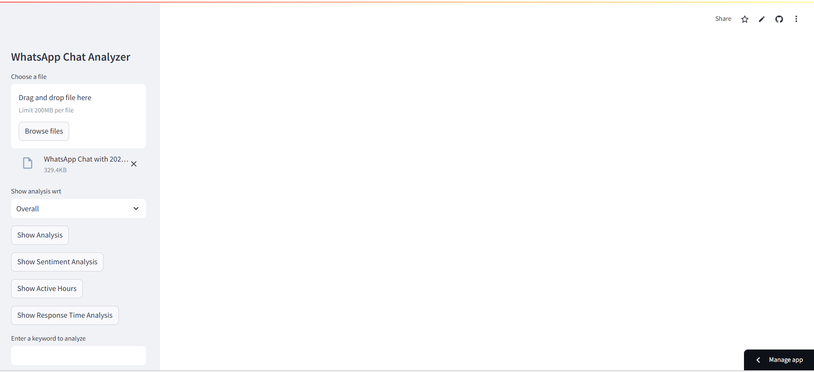
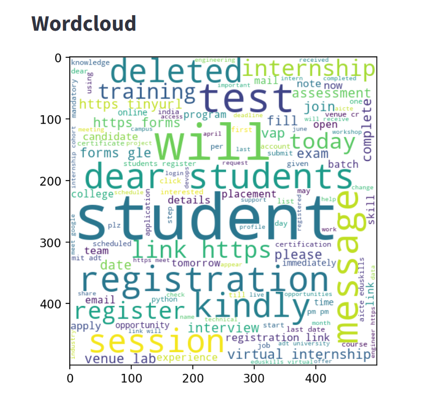
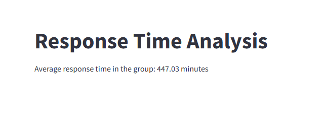
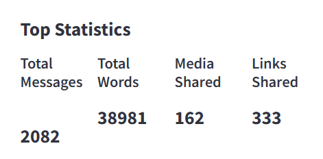
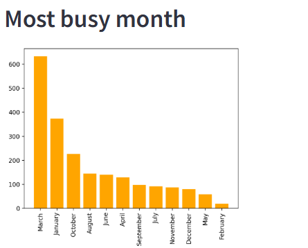
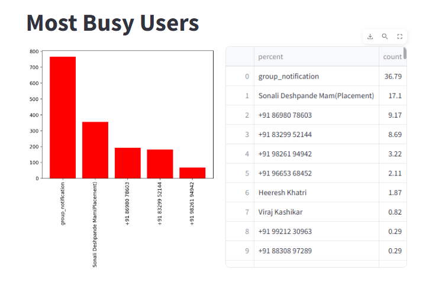
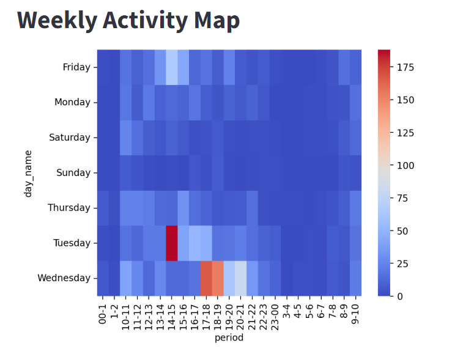

# Chat Analyzer using WhatsApp Data Visualization

**Description**  
 Chat Analyzer using WhatsApp Data Visualization is a tool that provides insights into WhatsApp chat files. It allows users to upload chat exports and analyze key metrics such as:

- Total messages, words, media, and links shared.
- Busiest users in the group.
- Activity trends (daily and monthly).
- WordCloud of commonly used words.
- Emoji usage analysis.
- Sentiment analysis of conversations.

---

## **Features**
- 📊 **Detailed Statistics**: Total messages, words, media, and links shared.
- 📅 **Activity Insights**: Analyze activity by day, month, and hour.
- ☁️ **Word Cloud**: Visualize frequently used words.
- 😊 **Emoji Analysis**: Explore emoji usage patterns.
- 🔍 **Keyword Analysis**: Find how often a specific word was used.
- 📈 **Timelines**: Monthly and daily message trends.

---

## **Technologies Used**
- **Python**
- **Streamlit**: For creating the web app.
- **Matplotlib/Seaborn**: For visualizations.
- **Pandas**: For data analysis.
- **Natural Language Processing (NLP)**: For text preprocessing, sentiment analysis, and keyword extraction.
- **TextBlob**: For sentiment analysis.
- **WordCloud**: For generating word clouds.

---

## **How to Use**
1. Export your WhatsApp chat data as a `.txt` file (without media).
2. Upload the file to the app.
3. Select options from the sidebar to analyze statistics, timelines, emoji usage, and more!

---
### **Screenshots**

#### **Home Page (File Upload)**

#### **WordCloud**

#### **Response Time Analysis**

#### **Top Statistics**

#### **Monthly Timeline**

#### **Most Busy Users**

#### **Weekly Activity Map**

---
## **Live Demo**
Check out the live app here: https://sciddhanto-whatsapp-chat-analyzer-app-dhu1ch.streamlit.app/

---
